# GoalBoard

[中文](README.md) | **English**

## Keep long-running Goals clear, decomposed, and verifiable across Sessions and Runtimes

### Why long-running work loses direction

- Work gradually drifts from the original Goal and the mismatch is found only near delivery.
- Switching Runtimes or opening a new Session means explaining the target, progress, and unfinished work again.
- Once a complex Goal branches into several execution paths, dependencies, ownership, and blockers become difficult to see.
- “Done” remains a conclusion in a conversation instead of a result backed by evidence.
- People have to wait for a Runtime summary instead of seeing what is happening, why it stopped, and what remains.

### The core idea

GoalBoard is a Goal ledger across Sessions and Runtimes, and a local execution workbench. It keeps outcomes, decomposition, dependencies, decisions, progress, and completion evidence in one traceable source of truth; the Runtime can change without losing the Goal. People confirm accepted Goals and changes, while Runtimes choose executable work and write claims, progress, and evidence back to the same project.

### One source of truth, three work surfaces

**Focus:** select a Goal to see its outcome, next action, completion requirements, and blockers.

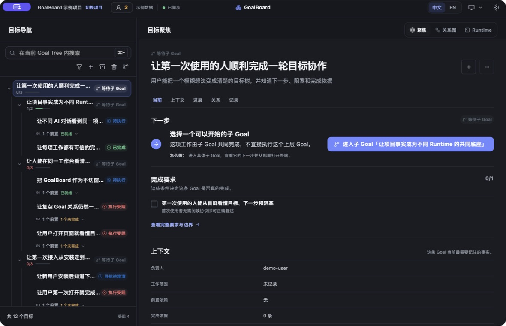

**Graph:** read project-level parent and dependency networks; circles mark sources and arrows point to targets.

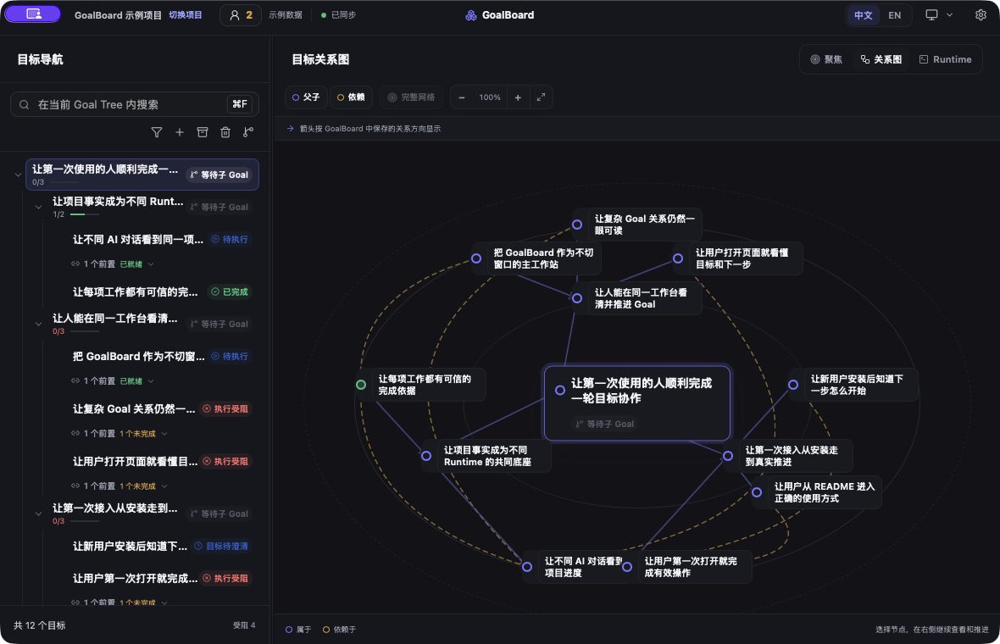

**Runtime:** open a terminal from a concrete Goal so the Session stays bound to that Goal.

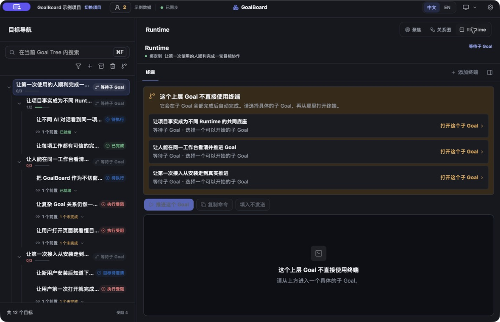

### A Goal layer, not Agent Orchestration

GoalBoard does not schedule a team of agents, and it does not replace Codex, Claude Code, or another Harness.

| | Responsibility |
| --- | --- |
| **GoalBoard** | Define the intended result, decomposition, dependencies, current state, and the evidence required for completion. |
| **Agent Orchestration** | Decide which agents participate and how they divide, coordinate, and execute the work. |

They work together: define a complex Goal, its child Goals, and dependencies in GoalBoard; then choose the right Runtime or agent team to execute it. Every entry point continues to write progress and evidence back to the same Goal facts.

## The loop from Goal to completion

1. **Define** the outcome, boundaries, and completion criteria so execution cannot quietly change the question.
2. **Decompose** work in a Goal Tree, then use Graph to understand complex dependencies and blocker propagation.
3. **Select** available work. A Runtime chooses and claims a Goal; unmet prerequisites prevent an early start.
4. **Execute** in an existing Harness, or open a Runtime TUI bound to a concrete Goal.
5. **Verify** progress, evidence, and review against the Goal. “Done” is more than a conversation summary.
6. **Evolve** through explicit proposals. New work, dependency changes, and risks enter the accepted Goal Tree only after the user confirms their reason and impact.

The loop keeps long-running work stable without making it rigid: a Runtime cannot silently rewrite an accepted Goal, and facts discovered during execution still have a defined path into the project.

## Three ways to work

| Mode | Best for |
| --- | --- |
| **Desktop workstation** | Use GoalBoard as the main workspace, with Goals, relationships, and Runtime in one window; global controls live in the native TitleBar. |
| **Beside a Harness** | Dock the narrow Desktop app next to Codex or another desktop Harness; the conversation executes while GoalBoard keeps the same Goal, next action, blockers, and criteria visible. |
| **Web workbench** | Use the same local project in a browser without installing a desktop GUI. Web and Desktop share the same data. |

### Run the same loop inside Codex

The main Session manages the whole Goal Tree: it confirms outcomes, adjusts dependencies, and decides which work a new request affects. GoalBoard stays open in Codex's internal side browser; select an executable leaf Goal, choose a Runtime, and continue in a TUI bound to that Goal without leaving the window.

**Narrow side panel: Goal list, current Goal, and bound Runtime**

<p align="center">
  <a href="docs/screenshots/showcase/codex-internal-goals-en.png">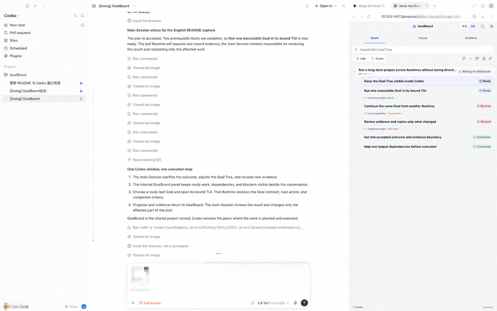</a>
  <a href="docs/screenshots/showcase/codex-internal-focus-en.png">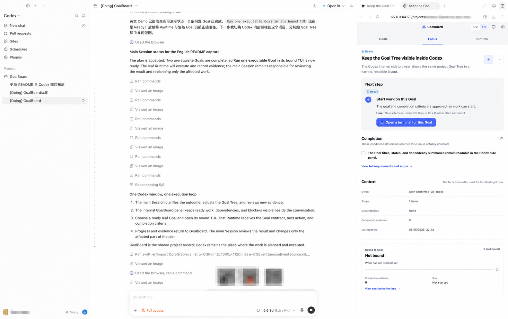</a>
  <a href="docs/screenshots/showcase/codex-internal-runtime-en.png">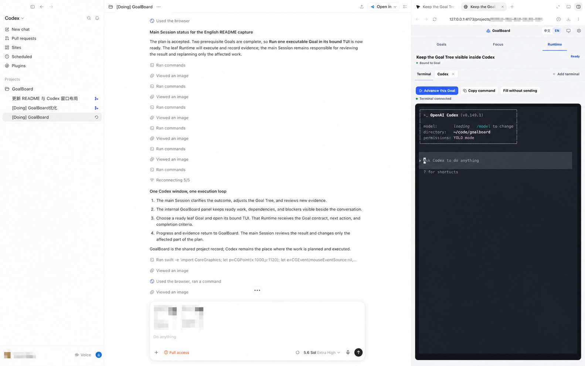</a>
</p>

**Choose a Runtime, then enter the Goal-bound TUI**

<p align="center">
  <a href="docs/screenshots/showcase/codex-internal-runtime-picker-en.png">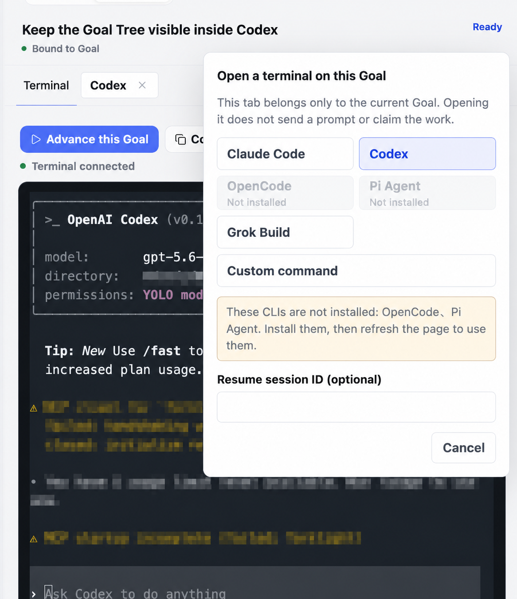</a>
  <a href="docs/screenshots/showcase/codex-internal-focus-main-en.png">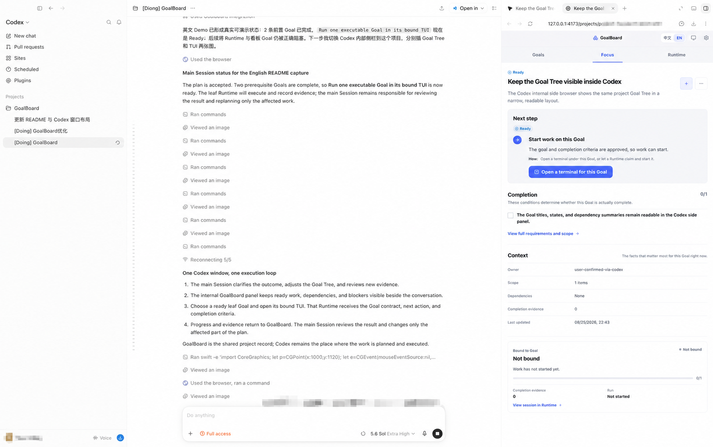</a>
</p>

**Wider side panel: Goal Navigator beside the current work**

<p align="center">
  <a href="docs/screenshots/showcase/codex-internal-navigator-focus-en.png">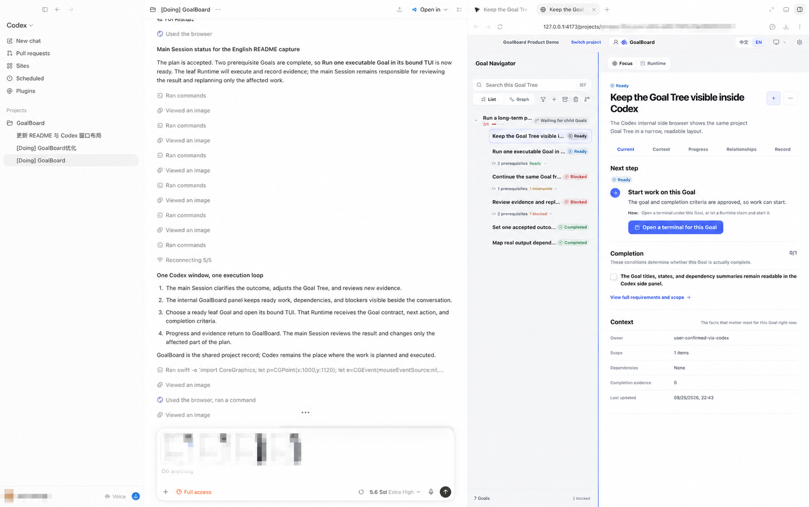</a>
  <a href="docs/screenshots/showcase/codex-internal-navigator-runtime-en.png">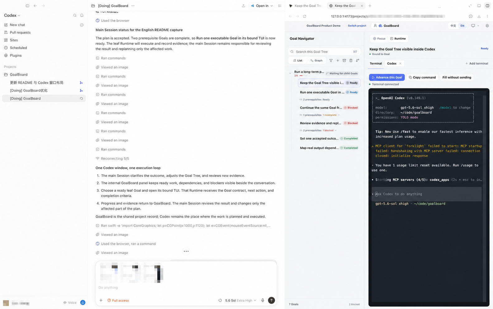</a>
</p>

Every entry point reads and writes the same Goal facts: the main Session plans and reviews, a leaf Goal's TUI executes, and progress and evidence return to GoalBoard.

### Or use GoalBoard as the Desktop workstation

The narrow window is not a squeezed three-pane layout. Switch between `Goals`, `Focus`, and `Runtime` while keeping GoalBoard docked beside the Harness.

<p align="center">
  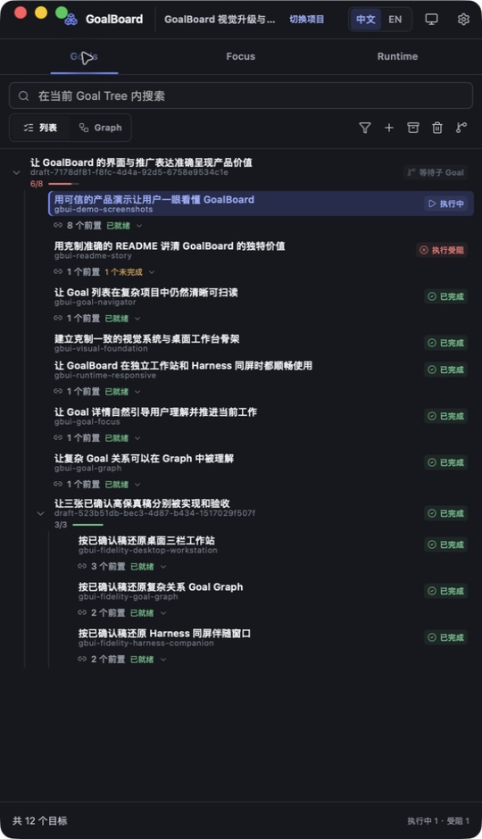
  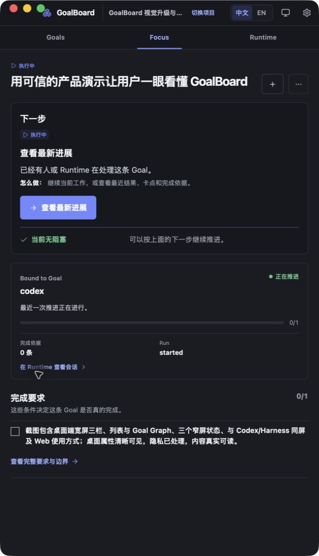
  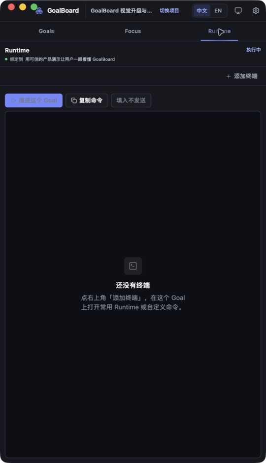
</p>

A Runtime with a CLI or TUI can start directly from an executable leaf Goal. The terminal remains owned by the Goal from which it was opened; a compound parent organizes outcomes and directs execution to a concrete child instead of opening a terminal itself.

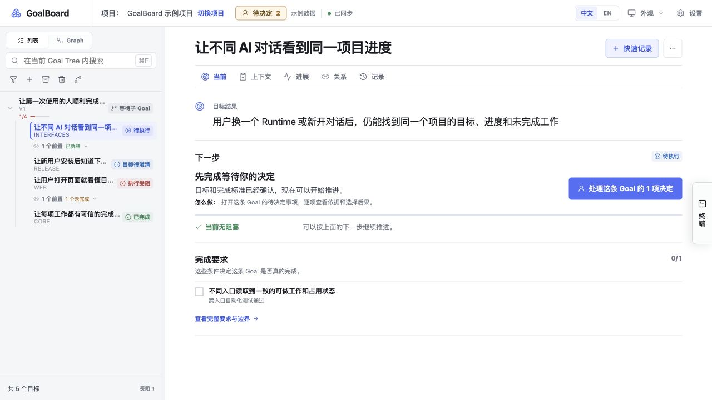

Built-in launch recipes cover Codex, Claude Code, OpenCode, Pi Agent, and Grok Build, with custom commands supported as well. Other desktop Harnesses can read and update the same project through GoalBoard's MCP server and shared Skill.

## Try it in 3 minutes

### macOS Desktop (recommended)

Download the DMG for your Mac from [GitHub Releases](https://github.com/adeptify/GoalBoard/releases):

- Apple Silicon (M1/M2/M3/M4…): `macos-arm64`
- Intel Mac: `macos-x64`

Open the DMG, drag GoalBoard into Applications, and launch it. Desktop includes Node and the GoalBoard Runtime. On first launch it installs Core into `~/.goalboard` and starts the same local workbench, without requiring Node, pnpm, or a repository checkout. App upgrades do not rewrite existing projects or history.

Development builds that are not signed with Developer ID and notarized by Apple still trigger Gatekeeper and require explicit approval in System Settings → Privacy & Security. The release workflow produces signed and notarized artifacts once the repository has the Apple credentials.

### Run from source

You need Node.js 20+, pnpm, and macOS (the persistent Web service currently uses LaunchAgent; other platforms can run Web in the foreground).

```bash
git clone https://github.com/adeptify/goalboard.git
cd goalboard
pnpm install --frozen-lockfile

# Build and install into ~/.goalboard
pnpm install:local

# macOS: install the persistent Web service
"$HOME/.goalboard/bin/goalboard" service install --home "$HOME/.goalboard" --confirm

# Create a rebuildable demo kept separate from user data
"$HOME/.goalboard/bin/goalboard" demo create --confirm
```

Open `http://127.0.0.1:4173` and enter the demo project. In “Settings → Runtime,” preview and confirm an integration, then **open a new Runtime Session**:

> Use GoalBoard to connect to the demo project, choose one currently executable Goal, and tell me its outcome, next action, and completion requirements.

Runtimes read MCP and Skill manifests at Session startup, so a newly connected Runtime needs a new Session.

### Build, install, and start macOS Desktop

```bash
# Run the development app from source
pnpm desktop

# Build a DMG and App zip for the current architecture
pnpm desktop:build:macos

# Install the freshly built DMG into ~/Applications and launch it
pnpm desktop:install:macos

# Start the installed app later
pnpm desktop:start:macos
```

Each architecture ships separately because GoalBoard's SQLite and PTY native addons must match both the bundled Node runtime and the Mac CPU. Pushing a `v*` tag makes GitHub Actions build Apple Silicon and Intel DMGs, but the public Release is published only after signing and notarization succeed. Credentials are read only from GitHub Secrets and never committed to the repository.

## Product boundaries

- The authoritative project state is stored in local SQLite; GoalBoard does not bundle a model.
- Opening a page does not bind a Session, start a Runtime, or claim work.
- Runtime integration, terminal launch, and accepted Goal changes require explicit action or confirmation.
- GoalBoard manages Goal facts and the execution loop; it does not replace a Harness or Agent Orchestration.

## Further reading

- [Install & Maintenance](docs/installation.en.md)
- [Runtime Protocol](docs/runtime.en.md)
- [MCP Integration](docs/mcp.en.md)
- [CLI & Development](docs/cli-and-development.en.md)
- [Runtime Skill](skills/goal-advance/SKILL.md)

## License

MIT, see [LICENSE](LICENSE).
