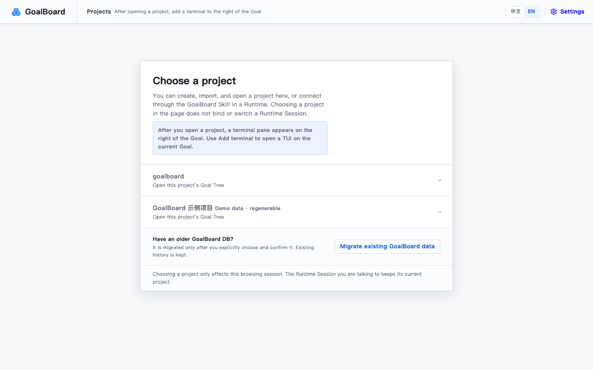

# GoalBoard

[中文](README.md) | **English**

> A goal ledger shared by humans and AI: the goal, the progress, and what "done" means are visible to both sides.

Have you been here before: the plan you worked out with AI yesterday is gone when you open a new conversation, and you have to explain the whole context again; requirements quietly drift while you talk, and by the time you notice, the work has already gone sideways; subtasks run in whatever order the AI feels like, so later work starts before earlier work is done and gets thrown away; the AI says "it's done" and you have no real way to know; you switch from Codex to Claude Code halfway and the two sides can't see each other's progress; the idea is still fuzzy but the AI rushes ahead, so you end up redoing it; you finally align on inputs and outputs, then the AI answers in jargon you can't follow; work stalls and you don't know what it's waiting for, while a pile of decisions that need you are buried in chat history.

So we built **GoalBoard** — a **non-intrusive** goal ledger shared between humans and AI, with **rich MCP integration** and **no AI of its own**:

- **Non-intrusive**: it doesn't launch your AI or force tasks onto anyone; work that can be done sits in a list and the AI picks it up itself;
- **Rich MCP**: the settings page auto-adapts to Codex, Claude Code, OpenCode, Pi Agent, and Grok Build; other MCP runtimes can speak the same protocol. Switch conversations or switch AIs and the goal is still there;
- **No AI of its own**: it isn't tied to any model — your AI stays the main actor;
- **A goal ledger**: goals, breakdowns, progress, and completion criteria are all on the books — who's working, where things stand, what's blocked, what's missing, and what's waiting for your decision are visible at a glance, so you never have to guess from chat history.

## Feature highlights

- **Goals survive conversations and AIs**: goals and progress live in the project; say "continue with GoalBoard" in a new conversation and it picks them back up. Multiple runtimes share the same ledger.
- **Goals don't quietly drift**: what's agreed stays agreed; when the AI wants to add something, it has to ask you first.
- **Order is set in stone**: until an upstream item is done, the AI can't even claim the next one.
- **No task breakdown or dispatch needed**: work that can be done sits in a list; the AI looks, picks, and starts, then reports back.
- **Done is visible**: every goal agrees on "what counts as done" up front, and the AI has to match results against it — "it's done" isn't enough.
- **Blockers and pending decisions are on the books**: what's blocked, what it's waiting for, and what decisions need you are all visible — nothing gets lost.
- **Three-pane workbench**: a Goal page shows the Goal Tree on the left, the continuous document in the middle, and a local terminal on the right — open Codex, Claude Code, OpenCode, Pi Agent, Grok Build, or a custom command **on the current Goal**.
- **Bilingual UI**: defaults to Chinese, switches to English in one click; Goal titles and body text stay in their original language.

## UI overview




Chinese UI screenshots live in the [Chinese README](README.md).

## 3-minute experience

You need Node.js 20+, pnpm, and macOS (the persistent Web service currently uses LaunchAgent; other platforms can still run Web in the foreground).

```bash
git clone https://github.com/adeptify/goalboard.git
cd goalboard
pnpm install --frozen-lockfile

# The only local install entry point: builds first, then installs into ~/.goalboard
pnpm install:local

# macOS: after explicit confirmation, keep Web running even after the terminal
# or Runtime Session closes
"$HOME/.goalboard/bin/goalboard" service install --home "$HOME/.goalboard" --confirm

# Create a rebuildable demo kept separate from user data
"$HOME/.goalboard/bin/goalboard" demo create --confirm
```

Open `http://127.0.0.1:4173`:

1. Enter the demo project and look at the Goal Tree, pending decisions, and completion evidence.
2. In "Settings → Runtime", pick Codex or Claude Code, review the change preview, and confirm the integration.
3. **Open a new Runtime Session** and say "continue with GoalBoard." Runtimes read MCP and Skill manifests only at Session startup, so tools installed just now won't appear in the current conversation.

To start from your own idea, say this in the new Session:

> Use GoalBoard to create a new project and clarify "make sure a friend can install and use it smoothly on the first try" into a Goal Tree.

GoalBoard keeps asking the key questions in the current conversation; only proposals you confirm enter the official Goal Tree.

## Further reading

- [Install & Maintenance](docs/installation.en.md): updating, demo data, persistent/temporary startup, safe uninstall, next steps
- [Runtime Protocol](docs/runtime.en.md): core concepts, Goal Contract, Runtime workflow
- [MCP Integration](docs/mcp.en.md): work-entry binding, context tools, permission boundaries
- [CLI & Development](docs/cli-and-development.en.md): CLI, one-time V3 import, project structure, development verification
- [Runtime Skill](skills/goal-advance/SKILL.md): the full protocol for Runtimes

## License

MIT, see [LICENSE](LICENSE).
