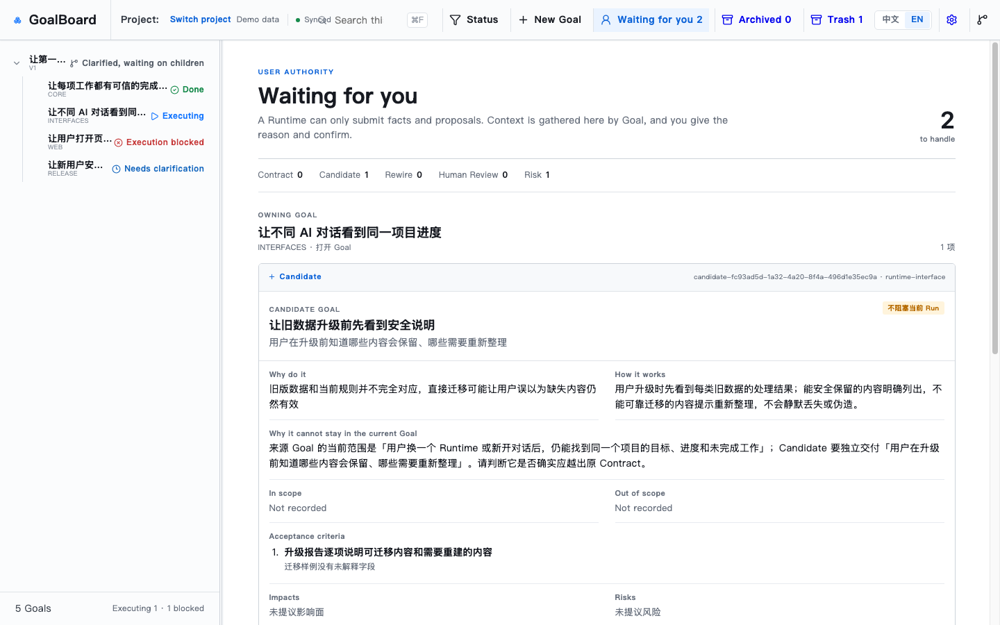
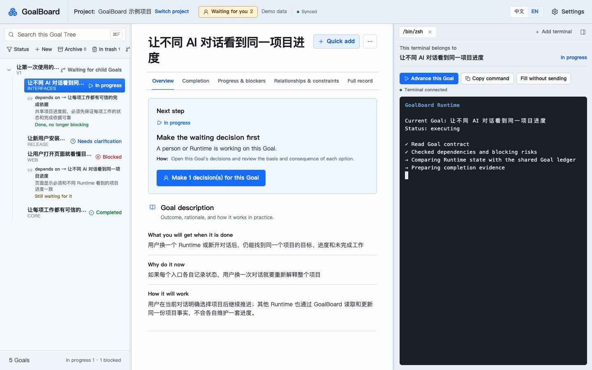

# GoalBoard

[中文](README.md) | **English**

## A shared Goal ledger and execution workbench for multiple Runtimes

GoalBoard keeps a project's Goal Tree, dependencies, execution progress, completion evidence, and user decisions in one place.

Different Runtimes can read and update the same project state. GoalBoard can sit beside an existing Harness, or open a Runtime TUI next to a specific Goal so that the Goal, Session, and execution context remain connected.


## Core capabilities

### One ledger across Runtimes

**Keep every Runtime working from the same project facts.**

- The Goal Tree, dependencies, risks, and completion criteria are stored together.
- Claims, runs, evidence, and reviews are written back to the same project.
- User decisions and Goal changes remain available as a durable record.

Codex, Claude Code, OpenCode, Pi Agent, Grok Build, and other connected Runtimes do not need to maintain separate plans.

### Goal management for long-running work

**Keep accepted Goals stable during execution while allowing the project to evolve through explicit changes.**

- Each Goal records its expected outcome, execution boundary, dependencies, and completion criteria.
- A Runtime cannot silently rewrite an accepted Goal; newly discovered work is proposed as a Candidate Goal.
- Decomposition, dependency, and scope changes explain their reason and impact, then take effect only after user confirmation.

Users can see what changed, why it changed, and whether the current work still serves the original Goal.

### Selection and constraints for executable work

**Let Runtimes make progress while respecting the agreed order and boundaries.**

- GoalBoard derives which work is available from Goal state, dependencies, and risks.
- Runtimes read, select, and claim executable Goals themselves; GoalBoard does not dispatch work.
- A Goal cannot start or complete while a prerequisite or blocking risk remains unresolved.

Claims are written back to the project so that other Runtimes can avoid work already in progress.

### Progress and completion that can be checked

**See the state of the project directly instead of relying on a Runtime's temporary summary.**

- The Goal Tree distinguishes pending, active, blocked, awaiting-decision, and completed work.
- The Goal document explains the current action, blocking reason, and unmet conditions.
- Completion is tied to concrete evidence and review results.

Users can see what is happening, why work has stopped, and what remains before a Goal is complete.



### Multiple ways to work

**Use GoalBoard with an existing workflow, or make it the primary workbench.**

- **Beside a Harness:** keep working in a familiar desktop app or terminal while checking Goals, progress, and evidence in GoalBoard.
- **In the browser workbench:** view the Goal Tree, Goal document, and Runtime TUI on one page.
- **In the macOS Desktop app:** open the same local workbench and enter the execution context from a specific Goal.

The browser and Desktop app use the same project data. A GUI-only Harness can run beside GoalBoard; a Runtime with a CLI or TUI can also run directly inside it.

### A Runtime TUI bound to its Goal

**Keep the Session, execution context, and active Goal explicitly connected.**

- Open Codex, Claude Code, OpenCode, Pi Agent, Grok Build, or a custom command from an executable Goal.
- The terminal continues to show its owner Goal; navigating elsewhere does not rebind it.
- A compound parent does not open an execution terminal and instead directs the user to a concrete child Goal.



A terminal remains owned by the Goal from which it was opened, reducing context drift during long-running work.

### Goal changes confirmed by the user

**Let Runtimes propose changes while the user retains authority over the accepted Goal.**

- A Runtime can submit a new Goal, dependency adjustment, risk, or review result.
- The Decision Center explains the question, its basis, and the effect of each option.
- A change enters the accepted Goal Tree only after user confirmation.

The project can incorporate facts discovered during execution without changing direction outside the user's view.

## Product boundaries

- The authoritative project state is stored in local SQLite.
- GoalBoard does not bundle a model or require replacing an existing Harness.
- Runtimes connect through MCP and a shared Skill.
- Opening a page does not bind a Session, launch a Runtime, or claim work.
- Runtime integration, terminal launch, and Goal changes require explicit action or confirmation.
- The macOS Desktop app is currently a source-run Preview.

## 3-minute experience

You need Node.js 20+, pnpm, and macOS (the persistent Web service currently uses LaunchAgent; other platforms can still run Web in the foreground).

```bash
git clone https://github.com/adeptify/goalboard.git
cd goalboard
pnpm install --frozen-lockfile

# The only local install entry point: builds first, then installs into ~/.goalboard
pnpm install:local

# macOS: after explicit confirmation, keep Web running even after the terminal
# or Runtime Session closes
"$HOME/.goalboard/bin/goalboard" service install --home "$HOME/.goalboard" --confirm

# Create a rebuildable demo kept separate from user data
"$HOME/.goalboard/bin/goalboard" demo create --confirm
```

Open `http://127.0.0.1:4173`:

1. Enter the demo project and inspect the Goal Tree, pending decisions, and completion evidence.
2. In "Settings → Runtime," choose the Runtime to connect, review the planned changes, and confirm the integration.
3. **Open a new Runtime Session** and ask it to use GoalBoard. Runtimes read MCP and Skill manifests only at Session startup, so tools installed just now will not appear in the current conversation.

To start from your own project, say this in the new Session:

> Use GoalBoard to create a project and organize the current idea into a Goal Tree that I can confirm incrementally.

Only proposals confirmed by the user enter the accepted Goal Tree.

## macOS Desktop Preview

After the local installation, run the Desktop app from source:

```bash
pnpm desktop
```

The Desktop app uses the same local service and project data. A signed, notarized installer for general users is not available yet.

## Further reading

- [Install & Maintenance](docs/installation.en.md): updating, demo data, persistent/temporary startup, safe uninstall, next steps
- [Runtime Protocol](docs/runtime.en.md): core concepts, Goal Contract, Runtime workflow
- [MCP Integration](docs/mcp.en.md): work-entry binding, context tools, permission boundaries
- [CLI & Development](docs/cli-and-development.en.md): CLI, one-time V3 import, project structure, development verification
- [Runtime Skill](skills/goal-advance/SKILL.md): the full protocol for Runtimes

## License

MIT, see [LICENSE](LICENSE).
