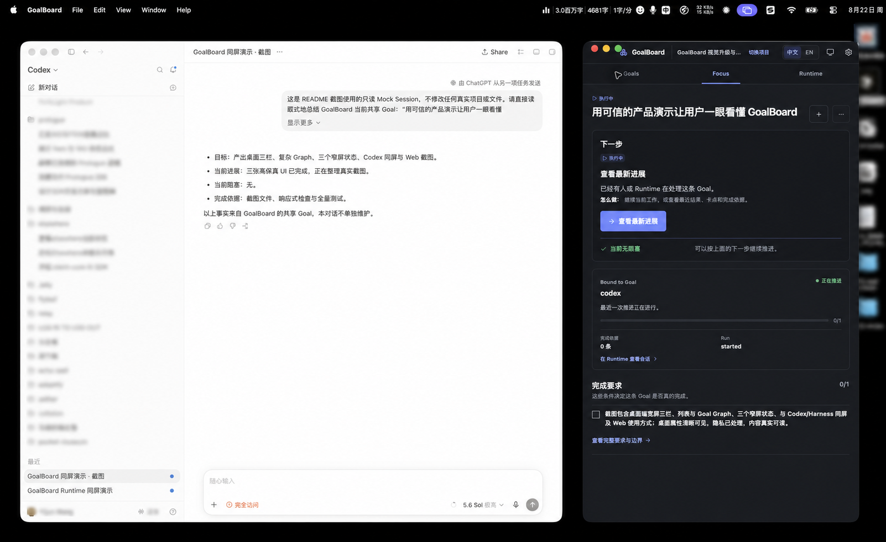

# GoalBoard

**中文** | [English](README.en.md)

## 让长程 Goal 跨 Session、跨 Runtime，仍然目标明确、拆分清楚、进度可核对

### 长程任务为什么容易失控

- 任务跑着跑着偏离原目标，往往到交付前才被发现。
- 换 Runtime 或新开 Session 后，目标、进展和未完成工作需要重新解释。
- 复杂 Goal 被拆成多条执行线后，依赖、占用和阻塞很快失去全貌。
- “已完成”停留在对话结论里，缺少可以核对的依据。
- 人只能等待 Runtime 汇报，无法随时判断正在做什么、为什么停住、还差什么。

### 核心思路

GoalBoard 是一份跨 Session、跨 Runtime 的 Goal 账本，也是一套本地执行工作台。它把目标结果、拆分、依赖、决定、进展和完成依据留在同一份可追溯事实中；Runtime 可以更换，Goal 不随对话消失。人确认正式目标和变化，Runtime 自主选择可执行工作，并把占用、进展和证据写回同一个项目。

### 一套事实，三个工作面

**聚焦**：选中一条 Goal，就看到目标、下一步、完成要求与当前阻塞。


**关系图**：在项目层查看父子与依赖网络；圆点是起点，箭头指向终点。


**Runtime**：从具体 Goal 打开终端，Session 始终与这条 Goal 关联。


### Goal 层，不是 Agent Orchestration

GoalBoard 不负责调度一群 Agent，也不替代 Codex、Claude Code 或其他 Harness。

| | 负责什么 |
| --- | --- |
| **GoalBoard** | 明确要得到什么、如何拆分、依赖什么、当前做到哪一步，以及凭什么算完成。 |
| **Agent Orchestration** | 决定哪些 Agent 参与、如何分工、通信和执行。 |

两者可以组合：复杂 Goal 先在 GoalBoard 中形成清楚的结果、子 Goal 和依赖，再交给合适的 Runtime 或 Agent team 执行；不同执行入口继续把进展和证据写回同一份 Goal 事实。

## 从 Goal 到完成的闭环

1. **定义**：写清结果、边界和完成标准，避免执行中偷偷改题。
2. **拆分**：用 Goal Tree 管理层级，用 Graph 看清复杂依赖和阻塞传播。
3. **选择**：Runtime 读取可执行 Goal，自主领取；前置条件不满足时不能提前开始。
4. **执行**：在现有 Harness 中继续工作，或从具体 Goal 打开与它绑定的 Runtime TUI。
5. **核验**：进展、证据和复核写回 Goal；“完成”不只是一句对话总结。
6. **演进**：新工作、依赖调整和风险先成为提案，说明原因与影响，经用户确认后进入正式 Goal Tree。

这套闭环让长程任务保持稳定，但不僵化：已确认的 Goal 不会被 Runtime 静默改写；执行中发现的新事实也有明确入口进入项目。

## 三种使用方式

| 使用方式 | 适合的工作方式 |
| --- | --- |
| **Desktop 工作站** | 把 GoalBoard 作为主工作台，在一个窗口内对照 Goal、关系和 Runtime；全局控制位于原生 TitleBar。 |
| **Harness 同屏** | 把窄版 Desktop 放在 Codex 等桌面 Harness 旁边；对话继续执行，GoalBoard 持续显示同一个 Goal 的下一步、阻塞和完成要求。 |
| **Web 工作台** | 不安装桌面 GUI，直接在浏览器查看同一项目；与 Desktop 共用本地数据。 |



窄窗口不是压缩后的三栏：可以在 `Goals`、`Focus` 和 `Runtime` 三个状态间切换，适合长期停靠在 Harness 旁边。

<p align="center">
  
  
  
</p>

具有 CLI/TUI 的 Runtime 可以直接从可执行叶子 Goal 打开。终端从哪个 Goal 启动，就持续属于哪个 Goal；复合父 Goal 只负责组织结果，不直接启动执行终端。


当前内置启动配方覆盖 Codex、Claude Code、OpenCode、Pi Agent、Grok Build，也支持自定义命令。其他桌面 Harness 可以通过 GoalBoard 的 MCP 与共享 Skill 读取和更新同一项目。

## 3 分钟体验

需要 Node.js 20+、pnpm，以及 macOS（常驻 Web 服务目前使用 LaunchAgent；其他系统可以前台启动 Web）。

```bash
git clone https://github.com/adeptify/goalboard.git
cd goalboard
pnpm install --frozen-lockfile

# 构建并安装到 ~/.goalboard
pnpm install:local

# macOS：安装常驻 Web 服务
"$HOME/.goalboard/bin/goalboard" service install --home "$HOME/.goalboard" --confirm

# 创建与用户数据分开的可重建示例
"$HOME/.goalboard/bin/goalboard" demo create --confirm
```

打开 `http://127.0.0.1:4173`，进入示例项目。然后在“设置 → Runtime”中预览并确认所需接入，再**新开一个 Runtime Session**：

> 使用 GoalBoard 连接示例项目，选择一个当前可执行的 Goal，并告诉我目标、下一步和完成要求。

Runtime 只在 Session 启动时读取 MCP 和 Skill，因此刚完成接入后需要新开 Session。

### macOS Desktop Preview

```bash
pnpm desktop
```

Desktop 使用同一套本地服务和项目数据。目前提供源码运行的 Preview，尚未提供正式签名、公证和面向普通用户的安装包。

## 产品边界

- 项目的权威状态保存在本地 SQLite；GoalBoard 不捆绑模型。
- 打开页面不会自动绑定 Session、启动 Runtime 或领取工作。
- Runtime 接入、终端启动和正式 Goal 变化都需要明确操作或确认。
- GoalBoard 管理 Goal 事实与执行闭环，不替代 Harness 或 Agent Orchestration。

## 更多文档

- [安装与维护](docs/installation.md)
- [运行时协议](docs/runtime.md)
- [MCP 接入](docs/mcp.md)
- [CLI 与开发](docs/cli-and-development.md)
- [Runtime Skill](skills/goal-advance/SKILL.md)

## License

MIT，见 [LICENSE](LICENSE)。
