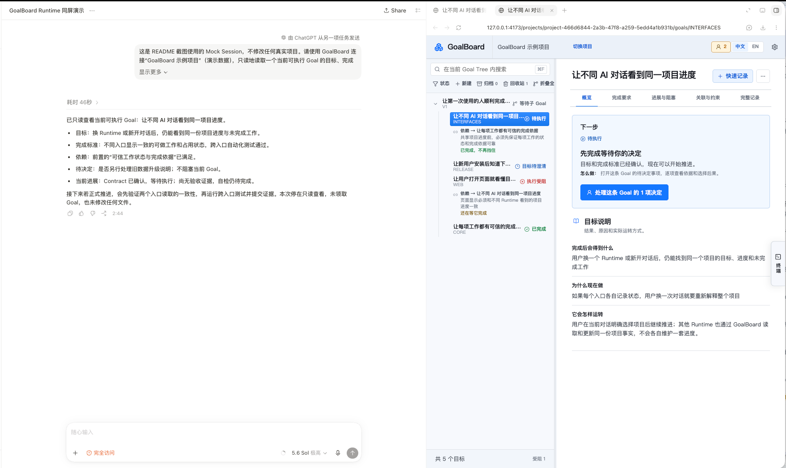
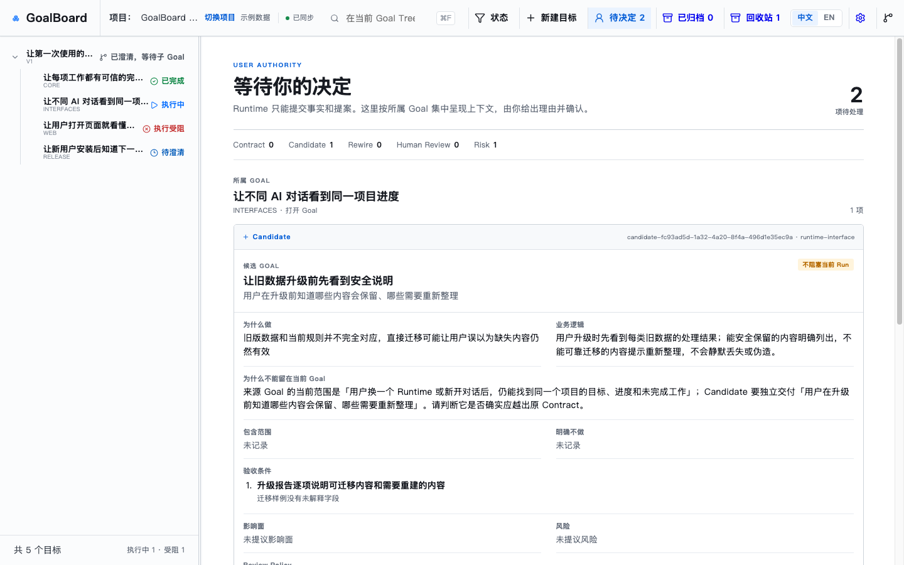
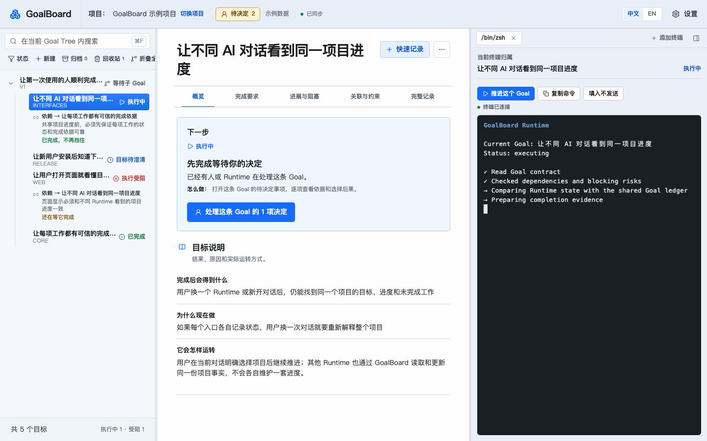

# GoalBoard

**中文** | [English](README.en.md)

## 面向多 Runtime 协作的 Goal 账本与执行工作台

GoalBoard 统一管理项目的 Goal Tree、依赖关系、执行进展、完成依据和用户决定。

不同 Runtime 可以读取和更新同一份项目状态。用户既可以将 GoalBoard 与现有 Harness 并排使用，也可以在具体 Goal 旁直接打开 Runtime TUI，让 Goal、Session 和执行现场保持关联。



## 核心能力

### 跨 Runtime 的共同账本

**让不同 Runtime 始终依据同一份项目事实工作。**

- Goal Tree、依赖、风险和完成标准统一保存；
- Runtime 的领取、执行、依据和复核写回同一项目；
- 用户决定与目标变化保留完整记录。

Codex、Claude Code、OpenCode、Pi Agent、Grok Build，以及其他接入 GoalBoard 的 Runtime，不必各自维护独立计划。

### 面向长程任务的 Goal 管理

**让已确认的 Goal 在持续执行中保持稳定，同时允许项目有记录地演进。**

- 每个 Goal 明确记录预期结果、执行边界、依赖关系和完成标准；
- 已确认的 Goal 不被 Runtime 静默改写，新需求先作为候选 Goal 提出；
- 拆分、依赖和范围变化说明原因与影响，经用户确认后才生效。

用户可以判断 Goal 发生了什么变化、为什么变化，以及当前工作是否仍围绕原目标推进。

### 可执行工作的选择与约束

**让 Runtime 自主推进，同时遵守已经确认的顺序和边界。**

- GoalBoard 根据 Goal 状态、依赖和风险判断哪些工作可以开始；
- Runtime 自主读取、选择并领取可执行 Goal，GoalBoard 不主动派单；
- 前置条件尚未满足或风险仍在阻塞时，相关 Goal 不能提前执行或完成。

领取状态会写回项目，其他 Runtime 可以据此避开已经有人处理的工作。

### 可核对的进展与完成

**让用户直接掌握项目进展，而不是依赖 Runtime 的临时总结。**

- Goal Tree 区分待执行、执行中、受阻、等待决定和已完成；
- Goal 页面说明当前行动、阻塞原因和未满足条件；
- 完成状态对应具体依据和复核结果。

用户可以随时判断正在做什么、为什么停住，以及距离完成还缺什么。



### 多种使用方式

**让 GoalBoard 适应现有工作习惯，也可以成为主要工作台。**

- **与 Harness 并排使用**：继续在常用桌面端或终端中工作，同时查看 GoalBoard 中的目标、进展和完成依据；
- **使用浏览器工作台**：在同一页面中查看 Goal Tree、Goal 正文和 Runtime TUI；
- **使用 macOS Desktop**：打开同一套本地工作台，从具体 Goal 进入执行现场。

浏览器和 Desktop 使用相同的项目数据。只有桌面 GUI、没有 CLI/TUI 的 Harness 可以与 GoalBoard 并排使用；具有 CLI/TUI 的 Runtime 还可以直接运行在 GoalBoard 内。

### 与 Goal 绑定的 Runtime TUI

**让 Session、执行现场和正在推进的 Goal 保持明确关联。**

- 从可执行 Goal 打开 Codex、Claude Code、OpenCode、Pi Agent、Grok Build 或自定义命令；
- 终端持续显示所属 Goal，切换页面不会改变已有终端的归属；
- 复合父 Goal 不直接启动执行终端，而是引导进入具体子 Goal。



终端从哪个 Goal 打开，就持续属于哪个 Goal，避免执行上下文在长程任务中逐渐偏离。

### 由用户确认的目标变化

**让 Runtime 可以提出变化，同时由用户保留正式目标的决定权。**

- Runtime 可以提交新 Goal、依赖调整、风险和复核结果；
- 决定中心说明当前问题、提出原因和不同选择的影响；
- 用户确认后，变化才会进入正式 Goal Tree。

项目可以吸收执行过程中发现的新信息，但不会在用户不知情的情况下改变方向。

## 产品边界

- 项目的权威状态保存在本地 SQLite；
- GoalBoard 不捆绑模型，也不要求替换现有 Harness；
- Runtime 通过 MCP 和共享 Skill 接入；
- 打开页面不会自动绑定 Session、启动 Runtime 或领取工作；
- Runtime 接入、终端启动和目标变化都需要明确操作或确认；
- macOS Desktop 当前为源码可运行的 Preview。

## 3 分钟体验

需要 Node.js 20+、pnpm，以及 macOS（常驻 Web 服务目前使用 LaunchAgent；其他系统仍可前台启动 Web）。

```bash
git clone https://github.com/adeptify/goalboard.git
cd goalboard
pnpm install --frozen-lockfile

# 唯一本地安装入口：会先构建，再安装到 ~/.goalboard
pnpm install:local

# macOS：明确确认后让 Web 常驻，关闭终端或 Runtime Session 也不会退出
"$HOME/.goalboard/bin/goalboard" service install --home "$HOME/.goalboard" --confirm

# 创建一份与用户数据分开的可重建示例
"$HOME/.goalboard/bin/goalboard" demo create --confirm
```

打开 `http://127.0.0.1:4173`：

1. 进入示例项目，查看 Goal Tree、待决定事项和完成依据；
2. 在“设置 → Runtime”中选择需要接入的 Runtime，先看改动预览，再确认接入；
3. **新开一个 Runtime Session**，要求它使用 GoalBoard 继续工作。Runtime 只在 Session 启动时读取 MCP 和 Skill，因此当前对话不会自动出现刚安装的工具。

想从自己的项目开始时，可以在新 Session 中说：

> 使用 GoalBoard 新建一个项目，并把当前想法整理成可以逐步确认的 Goal Tree。

只有用户确认的提案才会进入正式 Goal Tree。

## macOS Desktop Preview

完成本地安装后，可以从源码启动 Desktop：

```bash
pnpm desktop
```

Desktop 复用同一套本地服务和项目数据。目前尚未提供正式签名、公证和面向普通用户的安装包。

## 更多文档

- [安装与维护](docs/installation.md)：更新已有安装、演示数据、常驻/临时启动、安全卸载、安装后的下一步
- [运行时协议](docs/runtime.md)：核心概念、Goal Contract、Runtime 工作流
- [MCP 接入](docs/mcp.md)：工作入口绑定、context 工具、权限边界
- [CLI 与开发](docs/cli-and-development.md)：CLI、一次性 V3 导入、项目结构、开发验证
- [Runtime Skill](skills/goal-advance/SKILL.md)：给 Runtime 看的完整工作协议

## License

MIT，见 [LICENSE](LICENSE)。
