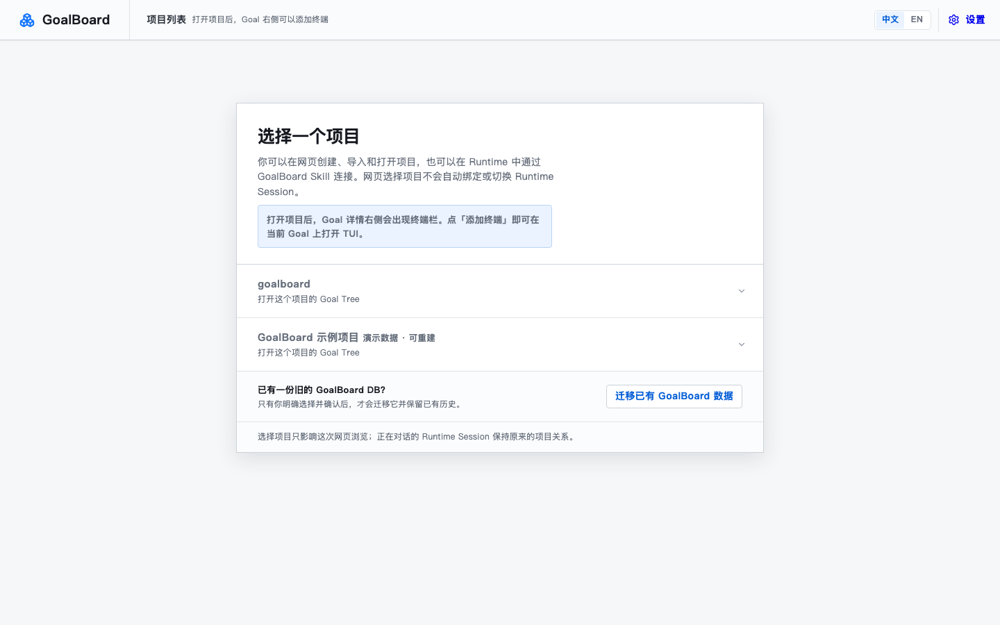

# GoalBoard

**中文** | [English](README.en.md)

> 你随口说的想法，会变成 AI 一直记得、不会跑偏、做没做完都看得见的目标。

你是不是也这样过：昨天跟 AI 聊好的方案，今天新开一个对话，它全忘了，背景又得从头讲一遍；聊着聊着需求被悄悄改掉，等你发现已经做歪了；几个子任务谁先谁后全靠 AI 心情，前置没做完后面的就白干；它说“做完了”，你心里却完全没底；Codex 干一半换 Claude Code，两边进度对不上；想法还一团模糊，它就急着开干，回头还得返工；好不容易对齐了输入输出，它又满嘴黑话，你根本看不懂它干了啥；活卡住了不知道在等什么，一堆该你拍板的事也埋没在聊天记录里。

所以我们推出 **GoalBoard**——一个**不侵入**的、提供**丰富 MCP** 的、**不包含自身 AI 功能**的，人和 AI 之间的**目标对账本**：

- **不侵入**：不启动你的 AI，也不把任务硬塞给谁；能做的事摆在列表里，AI 自己挑着做；
- **丰富 MCP**：设置页可自动适配 Codex、Claude Code、OpenCode、Pi Agent、Grok Build；其他 MCP Runtime 也能连上同一套协议。换对话、换 AI，目标都在；
- **没有自己的 AI**：不捆绑任何模型，你的 AI 才是主角；
- **目标对账本**：目标、拆分、进度、完成标准都记在账上——谁在干、做到哪、卡在哪、还差什么、什么在等你决定，打开就清楚，不用靠聊天记录去猜。

## 功能亮点

- **跨对话、跨 AI，目标不丢**：目标和进度存在项目里，新会话说一句「继续用 GoalBoard」就找回；多个 Runtime 共用同一份对账本。
- **目标不会悄悄跑偏**：目标说好了不随便改；AI 想加东西得先问你，你点头才作数。
- **先后顺序定得清清楚楚**：前置没做完，后面的活 AI 想领也领不走。
- **不用你拆任务派活**：能做的目标摆在列表里，AI 自己看、自己挑、自己开工，干完回来交差。
- **做没做完，看得见**：每个目标都说好「做到什么样算完」，AI 拿结果来对，对得上才算数。
- **卡住和待办都写在账上**：卡在哪、等什么、哪些决定等你拍板，一目了然，不会漏。
- **三栏工作台，边看边干**：Goal 详情页左边目标树、中间正文、右边本机终端，可直接在**当前 Goal** 上打开 Codex、Claude Code、OpenCode、Pi Agent、Grok Build 或自定义命令。
- **界面中英双语**：默认中文，可一键切换英文；Goal 标题和正文保持原文。

## 界面速览




英文界面截图见 [English README](README.en.md)。

## 3 分钟体验

需要 Node.js 20+、pnpm，以及 macOS（常驻 Web 服务目前使用 LaunchAgent；其他系统仍可前台启动 Web）。

```bash
git clone https://github.com/adeptify/goalboard.git
cd goalboard
pnpm install --frozen-lockfile

# 唯一本地安装入口：会先构建，再安装到 ~/.goalboard
pnpm install:local

# macOS：明确确认后让 Web 常驻，关闭终端或 Runtime Session 也不会退出
"$HOME/.goalboard/bin/goalboard" service install --home "$HOME/.goalboard" --confirm

# 创建一份与用户数据分开的可重建示例
"$HOME/.goalboard/bin/goalboard" demo create --confirm
```

打开 `http://127.0.0.1:4173`：

1. 进入示例项目，查看 Goal Tree、待决定事项和完成证据。
2. 在“设置 → Runtime”中选择 Codex 或 Claude Code，先看改动预览，再确认接入。
3. **新开一个 Runtime Session**，说“继续用 GoalBoard”。Runtime 只在 Session 启动时读取 MCP 和 Skill，所以当前对话不会凭空出现刚安装的工具。

想从自己的想法开始时，新 Session 接入后直接说：

> 用 GoalBoard 新建一个项目，帮我把“让朋友第一次安装就能顺利用起来”澄清成 Goal Tree。

GoalBoard 会在当前对话里继续问关键问题；只有你确认的提案才会进入正式 Goal Tree。

## 更多文档

- [安装与维护](docs/installation.md)：更新已有安装、演示数据、常驻/临时启动、安全卸载、安装后的下一步
- [运行时协议](docs/runtime.md)：核心概念、Goal Contract、Runtime 工作流
- [MCP 接入](docs/mcp.md)：工作入口绑定、context 工具、权限边界
- [CLI 与开发](docs/cli-and-development.md)：CLI、一次性 V3 导入、项目结构、开发验证
- [Runtime Skill](skills/goal-advance/SKILL.md)：给 Runtime 看的完整工作协议

## License

MIT，见 [LICENSE](LICENSE)。
