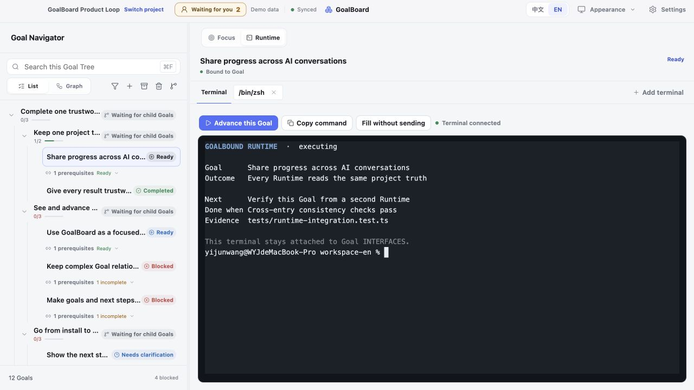
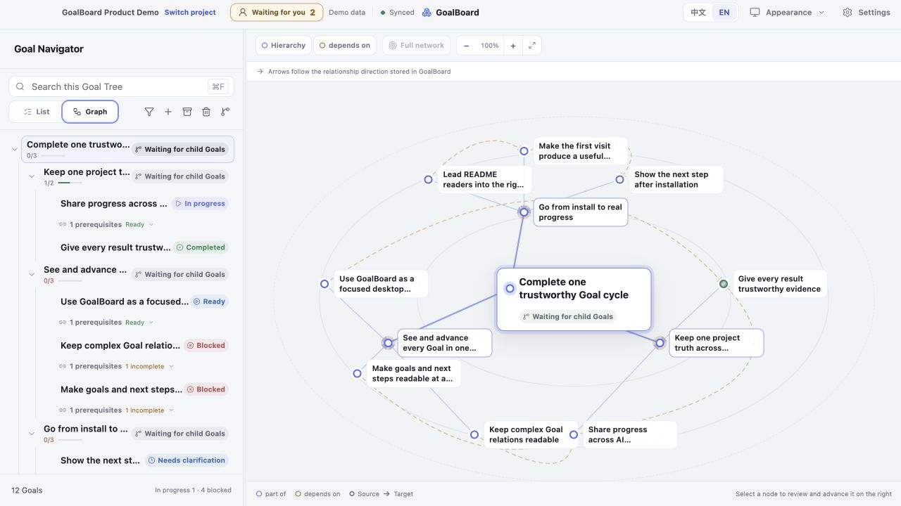
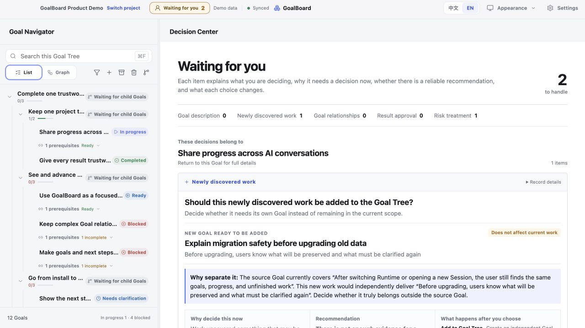
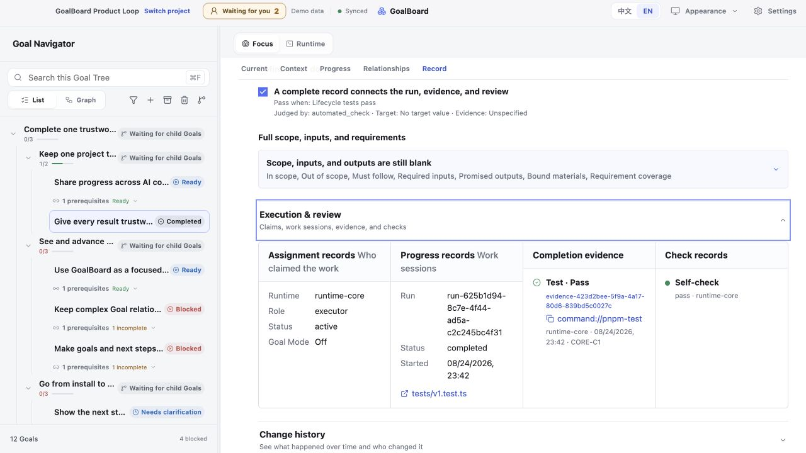
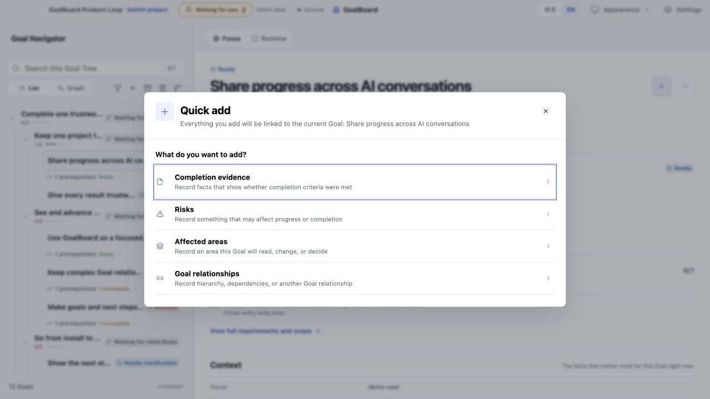
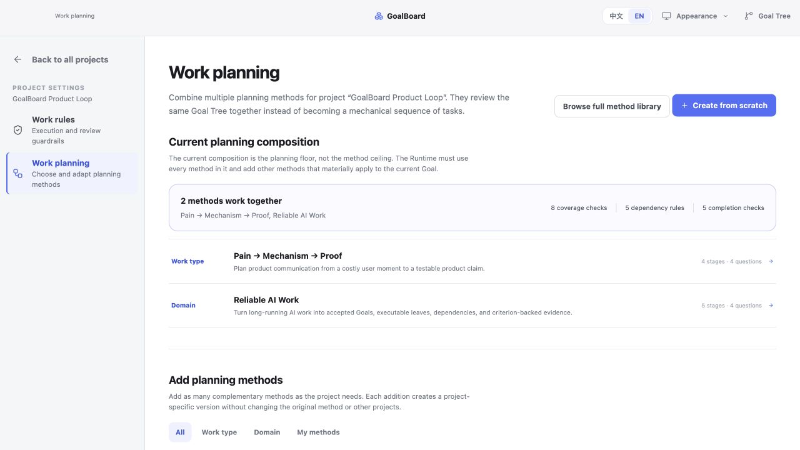
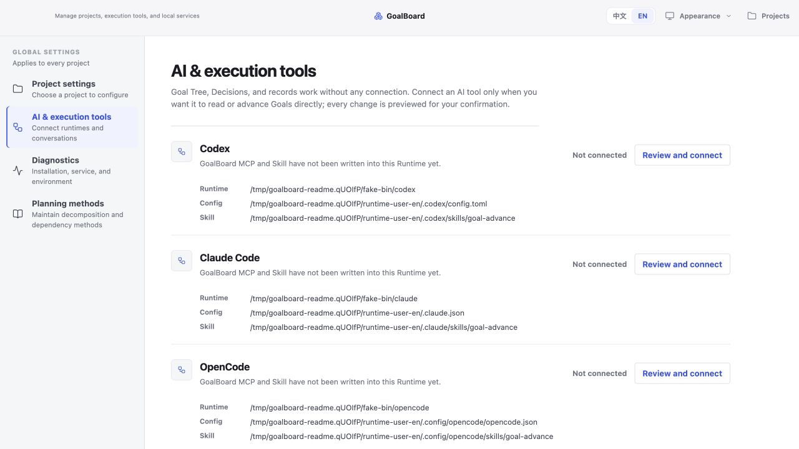

# GoalBoard

**English** | [简体中文](README.zh.md)

GoalBoard is a Goal ledger and workbench shared by different AI Runtimes.

Long-running work fails in a boring way: a new Session cannot see the last one, the original outcome drifts as local decisions pile up, and “done” is a sentence with nothing to check. What is missing is not a smarter model. It is one project record every Runtime can read: the accepted Goal, how it was split, what is blocked, who is working, and the evidence for completion.

GoalBoard keeps that record locally. Codex, Claude Code, OpenCode, or another connected Harness updates the same Goal. You confirm material changes. You can see how far the work has got without asking the model to recap.

It does not host a model and does not dispatch an agent team. Execution stays in the Harness you already use.

The longer derivation (WeChat article, link forthcoming): *[placeholder — 公众号文章待发布]*. Draft: [From conversational facts to ledger facts](https://github.com/adeptify/article/blob/main/AI%E9%95%BF%E7%A8%8B%E4%BB%BB%E5%8A%A1-%E4%BB%8E%E5%AF%B9%E8%AF%9D%E6%80%81%E4%BA%8B%E5%AE%9E%E5%88%B0%E8%B4%A6%E6%9C%AC%E6%80%81%E4%BA%8B%E5%AE%9E.md).

## Three ways to use it

Same project, three surfaces.

### Desktop

A native macOS window: focus one Goal, then open a terminal that stays bound to it. GoalBoard also lives in the **macOS menu bar at the top of the screen** (a status item you can click — not minimizing to the Dock). Click it for the current project, focused Goal, status, and next action.

<p align="center">
  
  &nbsp;
  
</p>

<p align="center">
  <sub><b>Goal focus</b> · what this Goal is, the next action, and what still blocks it &nbsp;·&nbsp; <b>Goal-bound TUI</b> · the terminal belongs to this Goal</sub>
</p>

### Inside a Harness

Open GoalBoard in the Harness side browser and keep working in the same window. Narrow: the Goal list. Wider: the current Goal and its TUI.

<p align="center">
  <a href="docs/screenshots/showcase/codex-internal-goals-en.png"></a>
  <a href="docs/screenshots/showcase/codex-internal-navigator-runtime-en.png"></a>
</p>

<p align="center">
  <sub><b>Narrow</b> · Goal list beside the conversation &nbsp;·&nbsp; <b>Wide</b> · current Goal and a TUI bound to it</sub>
</p>

### Web

The same local project in a browser. Desktop and Web share data under `~/.goalboard`.


Built-in Runtime recipes cover Codex, Claude Code, OpenCode, Pi Agent, and Grok Build. Other Harnesses can use the same project through GoalBoard's MCP server and shared Skill.

## Core features

Plain use, and the problem each one is for.

### See the Goal, the next action, and why it is stuck

Open a Goal. The page should answer three questions without reading the chat: what we are trying to get, what to do now, and why it cannot finish yet. Parent Goals organize a larger result; only a concrete leaf is executable.


### See who depends on whom

The Graph is for when the list is no longer enough. Parent/child is structure. A dependency is a hard gate: if B needs A's result, B cannot start early. When a requirement changes, you can see which downstream work is affected instead of re-explaining the whole tree.



### You confirm material changes

A Runtime may discover new work, a new dependency, or a risk. It can propose. It cannot quietly rewrite an accepted Goal. The Decision Center puts the question, why it matters now, the evidence or the gap, and what each choice changes in one place.



### Keep the terminal on the Goal

Open Codex, Claude Code, or a custom command from an executable leaf. That terminal stays owned by that Goal — switching Focus later does not silently reassign it. A parent Goal does not pretend to be executable; it sends you to a child.


On macOS, the same current Goal is also on the **top menu bar**. Click the GoalBoard status item — not the Dock — for the project, the focused Goal, its state, and the next action; click away and the panel disappears.

### Treat “done” as something you can check

Completion is not a sentence in chat. Each Goal has criteria. Evidence maps to those criteria. The required review has to pass. The record keeps who worked it, what was produced, and why it counts as complete.



If something new shows up while you work — proof, a risk, an affected area, a relation — attach it to the current Goal with **Quick add**. It stays on the Goal instead of disappearing into the thread.



### Tell the Runtime how this project should be split

Planning methods are not a task template and they do not auto-build the tree. They are the questions a Runtime must work through before it proposes a split: what to cover, what depends on what, what “done” must show. A project can combine a work-type method and a domain method. The result is still a proposal you confirm.



### Connect a Runtime on purpose

GoalBoard works as a board with no Runtime connected. Connect Codex, Claude Code, or another tool only when it should read and advance Goals directly. Every write is previewed; you confirm; a failed apply rolls back. After connecting, open a **new Session** — tools load at Session start.



## Try it in 3 minutes

### macOS Desktop (recommended)

Download the DMG for your Mac from [GitHub Releases](https://github.com/adeptify/GoalBoard/releases):

- Apple Silicon (M1/M2/M3/M4…): `macos-arm64`
- Intel Mac: `macos-x64`

Open the DMG, drag GoalBoard into Applications, and launch it. Desktop includes Node and the GoalBoard Runtime. On first launch it installs Core into `~/.goalboard` and starts the same local workbench, without requiring Node, pnpm, or a repository checkout. App upgrades do not rewrite existing projects or history.

Development builds that are not signed with Developer ID and notarized by Apple still trigger Gatekeeper and require explicit approval in System Settings → Privacy & Security. The release workflow produces signed and notarized artifacts once the repository has the Apple credentials.

### Run from source

You need Node.js 20+, pnpm, and macOS (the persistent Web service currently uses LaunchAgent; other platforms can run Web in the foreground).

```bash
git clone https://github.com/adeptify/goalboard.git
cd goalboard
pnpm install --frozen-lockfile

# Build and install into ~/.goalboard
pnpm install:local

# macOS: install the persistent Web service
"$HOME/.goalboard/bin/goalboard" service install --home "$HOME/.goalboard" --confirm

# Create a rebuildable demo kept separate from user data
"$HOME/.goalboard/bin/goalboard" demo create --confirm
```

Open `http://127.0.0.1:4173` and enter the demo project. In “Settings → Runtime,” preview and confirm an integration, then **open a new Runtime Session**:

> Use GoalBoard to connect to the demo project, choose one currently executable Goal, and tell me its outcome, next action, and completion requirements.

Runtimes read MCP and Skill manifests at Session startup, so a newly connected Runtime needs a new Session.

### Build, install, and start macOS Desktop

```bash
# Run the development app from source
pnpm desktop

# Build a DMG and App zip for the current architecture
pnpm desktop:build:macos

# Install the freshly built DMG into ~/Applications and launch it
pnpm desktop:install:macos

# Start the installed app later
pnpm desktop:start:macos
```

Each architecture ships separately because GoalBoard's SQLite and PTY native addons must match both the bundled Node runtime and the Mac CPU. Pushing a `v*` tag makes GitHub Actions build Apple Silicon and Intel DMGs, but the public Release is published only after signing and notarization succeed. Credentials are read only from GitHub Secrets and never committed to the repository.

## Product boundaries

- The authoritative project state is stored in local SQLite; GoalBoard does not bundle a model.
- Opening a page does not bind a Session, start a Runtime, or claim work.
- Runtime integration, terminal launch, and accepted Goal changes require explicit action or confirmation.
- GoalBoard manages Goal facts and the execution loop; it does not replace a Harness or Agent Orchestration.

## Further reading

- [Install & Maintenance](docs/installation.en.md)
- [Runtime Protocol](docs/runtime.en.md)
- [MCP Integration](docs/mcp.en.md)
- [CLI & Development](docs/cli-and-development.en.md)
- [Runtime Skill](skills/goal-advance/SKILL.md)

## License

MIT, see [LICENSE](LICENSE).
