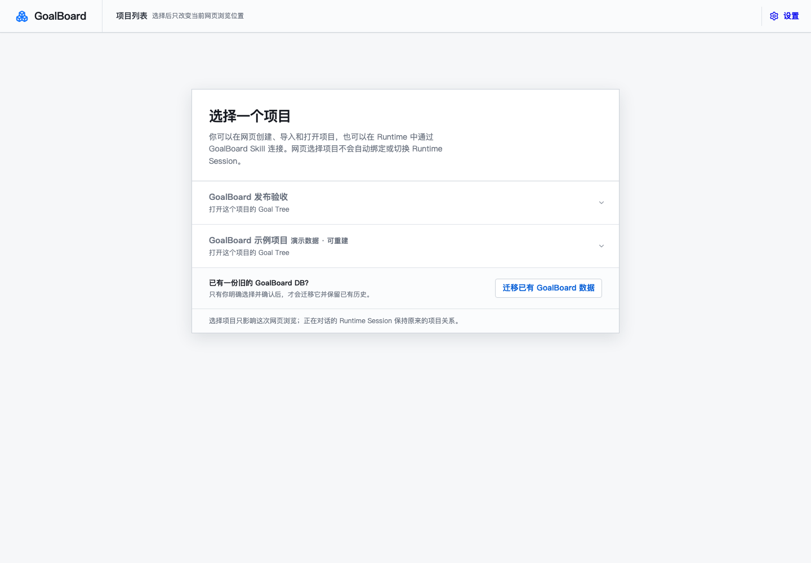
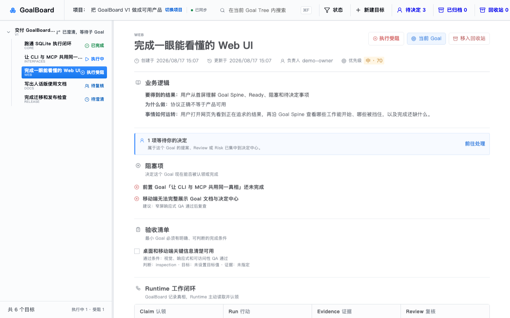
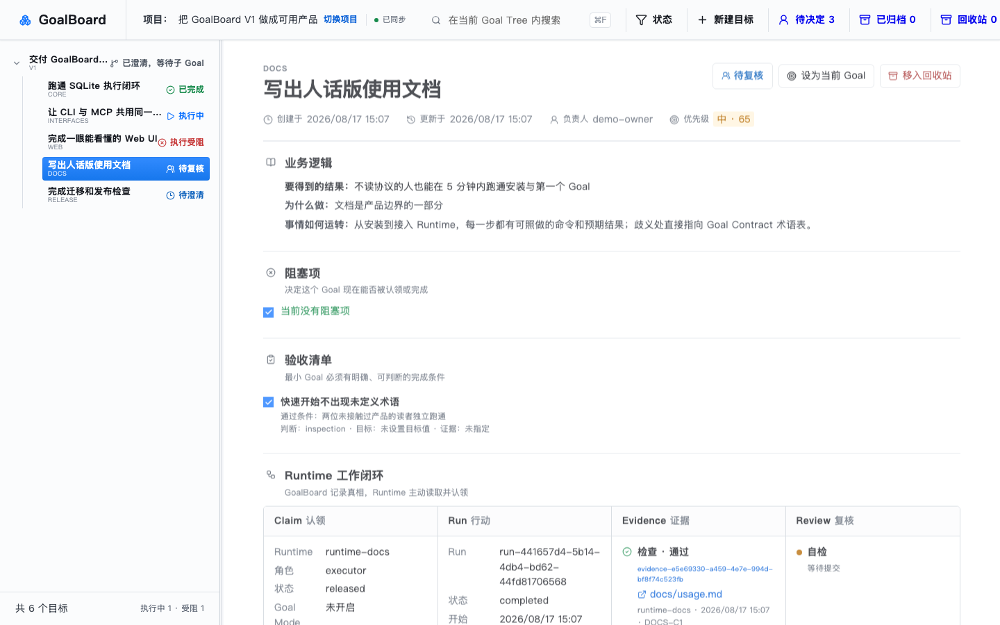
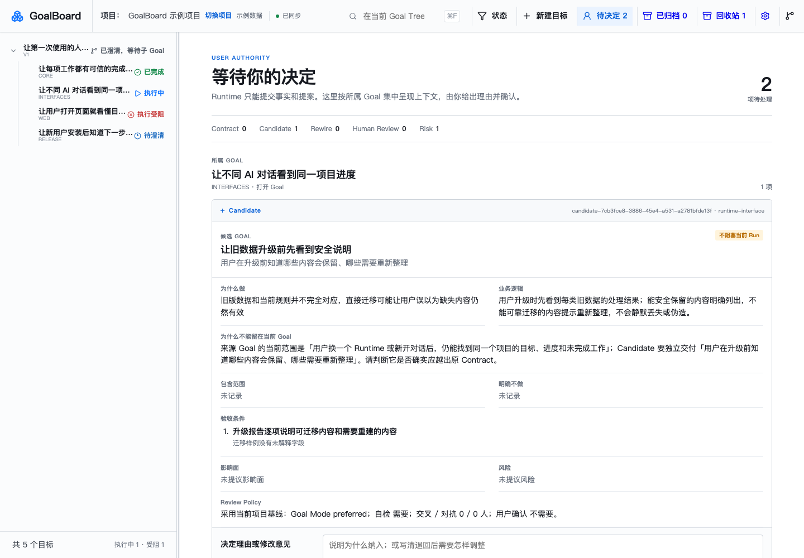
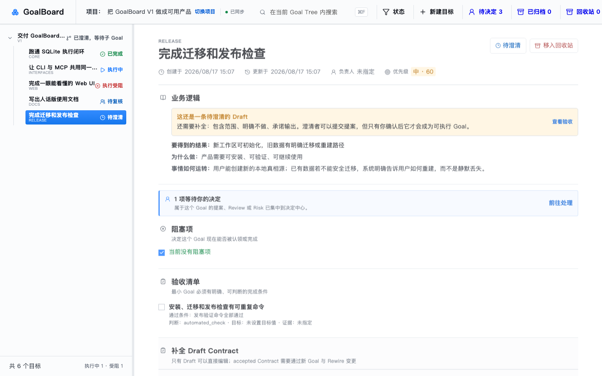

# GoalBoard

> 人和 Agent Runtime 共用的本地 Goal 真相源：目标、下一步、阻塞和完成证据，一眼可见。

GoalBoard 是人和 Agent Runtime 共用的本地 Goal 真相源。它用一份 SQLite 保存 Goal Contract、树与依赖、风险、Claim、Run、Evidence、Review、Candidate 和 Rewire。

GoalBoard 不启动 Runtime，也不分发任务。当前 Runtime 从统一 Available 集合自主选择一项，原子地创建 Claim 和 Run；Web 是可选查看与用户确认界面，不是推进 Goal 的必经步骤。

```text
用户在当前 Runtime 输入粗略想法或要求推进已有 Goal
→ Runtime 通过 MCP 创建并自然语言澄清 Draft，或从 Available 自主选择并开始执行、复核或重新验证
→ Runtime Skill 约束工作方式
→ Runtime 在当前对话中解释提案，用户确认、拒绝或修改其中的条目
→ GoalBoard 把已确认部分物化为 Goal Tree，并自动更新工作状态
→ 用户可选地在 GoalBoard 查看 Contract、依赖、风险和进度
→ Runtime 回传 Evidence 与 Review
→ Coordinator 判定 Goal 是否完成
```

## 为什么需要 GoalBoard

用 AI 推进真实项目时，最常见的三个问题：

- **AI 会话会失忆**：新开一个对话，背景和上下文要重新讲一遍；
- **目标会被悄悄带偏**：聊着聊着需求就变了，改没改、为什么改，没有人确认；
- **“做完”没有标准**：AI 说完成了，但你不知道离真正想要的还差多远。

GoalBoard 的答案是：把目标变成人和 Runtime 共同维护的真相源。目标是拆解过的、有验收条件的；每一步工作在做什么、由谁在做、卡在哪、完成还缺什么，都可以直接查，而不是靠聊天记录去猜。

## 界面速览











## 演示数据

仓库自带一套演示数据生成脚本，用于截图、体验和开发：

```bash
pnpm exec tsx examples/seed-demo.mts            # 写入 ~/.goalboard
pnpm exec tsx examples/seed-demo.mts --force   # 同名项目已存在时重建
```

它会创建三个本地项目：「把 GoalBoard V1 做成可用产品」「宠物寄养小程序 MVP」「读书笔记同步 CLI」，覆盖已完成、执行中、执行受阻、待复核、待澄清等状态。脚本只写 GoalBoard 自己的项目目录，可安全重复运行。

## 快速开始

需要 Node.js 20 或更高版本。

```bash
pnpm install --frozen-lockfile
pnpm build
pnpm test

# 只安装 GoalBoard 本体；不会修改项目或 Runtime 配置
goalboard install

# Web 只从 GoalBoard 自己的项目目录列出可浏览项目
"$HOME/.goalboard/bin/goalboard-web" --home "$HOME/.goalboard"
```

打开 `http://127.0.0.1:4173` 后，可以在设置中创建、导入、改名和打开项目，也可以先配置 Codex / Claude Code 接入。选择一个项目只改变网页浏览位置，不会自动绑定或切换当前 Runtime Session；已有旧 DB 只有明确选择并确认后才会迁入项目。

> **注意**：`goalboard-web` 是前台进程，**请保持运行它的终端窗口开启**——关闭终端会同时关闭前端。临时体验也可以这样后台启动：
>
> ```bash
> nohup "$HOME/.goalboard/bin/goalboard-web" --home "$HOME/.goalboard" >/tmp/goalboard-web.log 2>&1 &
> ```
>
> 更稳定的常驻方案（LaunchAgent、`goalboard web --detach`）在规划中；需要随时重启网页服务的，也可以直接重新运行上面任一条命令。

### 安装边界

`goalboard install` 只维护 `~/.goalboard`：版本化程序与共享 Skill、MCP/Web/CLI 启动入口、项目 DB 根目录、日志和安装清单。它不会创建或启动项目，不会写入用户项目，也不会修改任何 Runtime 的用户级配置。之后若要把 MCP 入口注册到某个 Runtime，必须走用户确认的 Runtime 集成流程。

项目目录使用不可变的 `project_id` 区分项目，显示名称可以改名或重名；每个项目都有自己的 `goalboard.db`。`projects/catalog.db` 保存项目身份、DB 位置，以及用户明确建立的 `Runtime 工作入口 → project_id` 绑定、切换、解绑、当前 Session 的候选拒绝和删除收据历史；不复制 Goal 事实，也不会扫描 Git、目录名或聊天内容来猜项目。宿主可以为新 Session 提供非权威线索，GoalBoard 也可把同一 Runtime 最近确认过的项目作为候选来排序；两者都绝不自动建立绑定。解绑只移除一个当前工作入口的绑定；删除项目及其 DB 必须单独确认，并会拒绝仍有有效 Claim 或未结束 Run 的项目。

### 安装后的下一步

`goalboard install` 只完成 GoalBoard 本体安装，默认输出安装位置、CLI/MCP/Web 启动器和安全边界；自动化可以使用 `goalboard install --json`。安装不会顺带创建项目、关联 Session、启动服务或修改 Runtime 配置。

安装后的 Runtime 接入由同一领域服务完成。当前 adapter 会只读探测 Codex 和 Claude Code，并先生成包含配置路径、GoalBoard MCP entry、Skill 链接、备份位置和重启说明的预览；只有用户对当前 Runtime 和当前 plan 明确确认后才会写入。MCP 与 Skill 作为一个事务验证，失败会恢复原配置字节和原 Skill 状态。移除时只撤销 GoalBoard ownership receipt 记录且仍未被用户改写的内容。未知同名配置或 Skill 会显示冲突，不会被覆盖。

接入确认完成后，**必须重开 Codex / Claude Code 会话**才会生效（MCP 和 Skill 配置只在启动时加载）。重启后明确说「继续用 GoalBoard」**并指定要关联的项目**（例如「关联『把 GoalBoard V1 做成可用产品』」）——Runtime 不会自动关联项目，必须等你的明确指令。接入预览界面会逐条展示改动内容和重启提示，安装输出也会给出同样的说明。

项目创建和当前 Session 关联是独立操作：用户在当前 Runtime 调用统一 Skill 后，Skill 使用 `context-list-projects`、`context-bind` 或 `context-create-and-bind`，并且只在用户明确选择后写入 GoalBoard 自己的项目目录。Web 可创建、导入、改名和打开项目，也可管理已经确认过的 Session 关联；网页中的项目选择本身不会改变 Runtime Session 绑定，新 Session 仍要先在对应 Runtime 对话里询问并确认。

Web 只监听 loopback 地址。每次启动都会生成只存在于本机页面中的随机控制令牌；所有 Web API 写请求还必须通过同源 Origin、控制令牌和一次性操作键校验。非本机 Host、第三方页面盲发、缺少凭据或重复请求都会在进入项目 catalog、Runtime 配置服务或 Goal Coordinator 前被拒绝。这个浏览器门禁不替代各领域流程原有的用户确认和幂等规则。

## 核心概念

| 概念 | 一句话说明 |
| --- | --- |
| Goal | 最小可执行目标，和 Task 同一粒度，必须有可观察或可量化的验收条件 |
| Goal Tree | 用户确认后的目标拆解结构，Plan 和看板都是它的派生视图 |
| 依赖 | 已确认的前置关系，是领取和完成的硬门禁 |
| Risk | 可能阻碍领取或完成的风险，需要人决定处理方式 |
| Claim | Runtime 对某个 Goal 的带时限占用，不是任务分配 |
| Run | 一次执行、复核或重新验证过程 |
| Evidence | 对应验收条件的证据（测试、检查、人工确认等） |
| Review | 自检、交叉或对抗性复核，通过后才算完成 |
| Candidate | 执行中发现的新工作，只能由用户决定是否接受 |
| Rewire | 用户确认后的目标关系重排 |

普通 Runtime 只能读取、选择、认领、执行、提交提案和证据，不能自行裁决 canonical Goal；所有推断和建议在用户确认前都不是权威事实。

## Goal Contract

用户可以在当前 Runtime 提出一个粗略想法；GoalBoard Skill 用 MCP 创建只有标题的 `draft / abstract` Goal。clarifier Runtime 读取项目事实并逐步提出 Outcome、Why、非技术业务逻辑、范围、输入输出、验收、依赖、风险和 Review Policy 的补全建议；这些建议只有在用户确认后才成为 accepted Contract。

最小可执行 Goal 与 Task 是同一粒度：结果在 Goal 内闭环，并且有可观察或可量化的验收条件。例如“设计用户 Domain，并提供可测试的增删改查方法”可以是一个叶子 Goal；“把账号系统做好”仍需继续拆分。

accepted Contract 不原地改版本。后续新需求创建新的 Candidate Goal，由用户分别决定是否接受新 Goal、是否确认 Rewire。

## Runtime 工作流

统一 GoalBoard Skill 被用户调用后，先解析当前 Runtime 宿主提供的稳定工作入口：已绑定则恢复该项目的固定 MCP 连接；新 Session 若有宿主线索或同一 Runtime 的已确认项目历史则返回候选项目和通用原因，但仍保持未绑定，当前 Runtime 必须问用户“要关联这个项目吗”；没有候选才在当前对话让用户选择已有项目或明确命名一个新项目。用户明确同意候选或已有项目时才调用 `context-bind`，明确拒绝一个候选时调用 `context-reject-suggestion`，它只停止当前 Session 重复提示该候选，不删除任何数据或影响其他 Session。新建项目才调用 `context-create-and-bind`；只有用户明确选择后才会写入绑定。已有入口切换到其他项目时还必须再次明确确认。用户明确要求“只在这里停用”时调用 `context-unbind`，只移除当前入口绑定；用户明确要求删除某一个命名项目及其数据时才调用 `project-delete`，它会先保护有效 Claim 和未结束 Run。宿主没有提供会话级标识时（例如 Codex 不把 `CODEX_THREAD_ID` 注入 MCP 子进程），GoalBoard 会退回用**工作目录**作为稳定身份锚点：同一目录的会话共享同一个项目关联；身份锚点不等于项目归属，首次绑定仍必须由用户明确确认。这个解析不会在 Runtime 启动或普通对话时后台发生。

Skill 的正常回复先用用户当前语言说明“我理解了什么、为什么还要确认这一点、接下来只问或做什么”，不会把 MCP 工具名和内部 ID 当作回答。新想法、已有 Draft 恢复和方向变化会显示可修改的结构化 checkpoint，明确区分用户已确认事实、可查项目事实、Runtime 假设和建议；每个实质回答先写入 dialogue turn，再继续下一问。提案就绪时用可读 Goal Tree 汇总结果、非目标、关系依赖、叶子验收、风险和确认后的状态，用户可以整份决定或点名修改条目。

项目连接明确后，当前 Runtime 再读取 `available` 和所选 Goal 的 Contract，并自己决定是否选择其中一项。GoalBoard 不返回“唯一下一份”；Claim 是带时限的占用，不是任务分配。

```text
new rough idea:
  draft-dialogue-start → 当前 Runtime 自然语言澄清
  → 每次实质回答 draft-dialogue-turn → proposal_summary
  → goal-tree-propose / read / check → 当前 Runtime 与用户对话决定条目 → goal-tree-decide

existing Draft:
  contract → 有保存的澄清会话则 draft-dialogue-resume
  → 否则 draft-dialogue-start(goal_id) 复用该 Draft 并开始当前对话澄清
  → proposal / 用户确认 → run-report → release

executor:
  available(next_action=execute) → contract → select-goal → 实现与验证
  → run-report → evidence-submit → review-submit → complete → release

reviewer:
  available(next_action=review) → contract → select-goal
  → review-submit → run-report → release

revalidator:
  available(next_action=revalidate) → contract → select-goal
  → 核对 Contract、active dependencies、Risks 和证据
  → revalidate → run-report → release
```

`select-goal` 在同一个 SQLite 事务中创建 Claim 和 Run；失败不会留下只有 Claim、没有 Run 的假“进行中”。正常 Runtime 工作流使用 `available` 与 `select-goal`；`ready`、`claim` 和 `run-start` 只用于低层管理或测试场景。

对于新想法，Runtime 不必让用户先打开 Web 或逐字段填写 Contract：`draft-dialogue-start` 在一个事务中创建最小 `draft / abstract` Goal、clarifier Claim 和 Run，随后当前对话每产生一次实质澄清进展就调用 `draft-dialogue-turn` 保存用户回答、当前理解、来源事实、假设和唯一下一问；Session 中断后用 `draft-dialogue-resume` 恢复。澄清完成时，当前 Runtime 用 `goal-tree-propose` 一次提交整份可确认的拆分／变更方案，并可通过 `goal-tree-read`、`goal-tree-check` 跨 Session 恢复和检查；推断和建议在用户确认前都不是 canonical Goal、关系、Risk 或 Policy。用户随后仍在当前 Runtime 对话中逐项确认、拒绝或要求修改；Runtime 调用 `goal-tree-decide`，由宿主注入可信用户和消息引用。已确认的安全条目才会物化，过期、悬空或循环条目会保持冲突，不影响其他已确认条目。

物化后不增加第二套“是否澄清完成”状态：确认的复合父 Goal 有子项时显示“已澄清，等待子 Goal”，确认的最小叶子显示“待执行”，仍是 Draft／开放拆分的分支才显示“待澄清”。

普通 Runtime 不能创建 canonical Goal、修改 accepted Contract、激活依赖或替用户决定 Candidate/Rewire。执行中发现的新工作只能提交 Candidate；发现依赖变化只能提交带方向、依据、证据、拒绝影响和置信度的 Dependency Proposal。

## MCP

GoalBoard 通过统一 Skill 的“工作入口绑定”连接项目：Runtime 宿主提供一个明确稳定的入口 ID，Skill 调用 `goalboard_v1_context_resolve` 后才从 `~/.goalboard/projects/catalog.db` 恢复项目连接。Runtime 不把数据库路径或 `board_id` 当作用户要选择的项目身份。

### Runtime 工作入口绑定（推荐）

Runtime 宿主只在自己能保证稳定性的情况下提供入口 ID；它不是 Git 地址、目录名、仓库结构或模型从对话中推断的字符串。复用同一个不透明 ID 只表示恢复同一个宿主 Session／工作入口；真正的新 Session 必须拿到新的 ID。Codex adapter 使用宿主提供给 MCP 子进程的 `CODEX_THREAD_ID`，Claude Code adapter 使用 Claude Code 的 Session ID 环境信号；两者都不会把 ID 固化进用户配置。当宿主没有提供会话级 ID 时，GoalBoard 退回用工作目录作为稳定身份锚点（`workspace:<hash>`），同一目录的会话共享同一个项目关联。宿主还可以单独提供工作空间、目录、会话标题、最近项目等非权威线索来排序新 Session 的候选；GoalBoard 也只会把同一 Runtime 最近确认的其他 Session 项目作为建议。不能把任何线索当作项目归属，也不能自动绑定。

安装本身不会写入 Runtime 配置。Codex 和 Claude Code 应由用户在接入预览中确认后使用稳定 launcher；其他 Runtime host 可以显式提供同一组环境值：

```bash
GOALBOARD_HOME="$HOME/.goalboard" \
GOALBOARD_RUNTIME_ID="<runtime-id>" \
GOALBOARD_WORK_CONTEXT_ID="<宿主提供的稳定工作入口 ID>" \
GOALBOARD_WORK_CONTEXT_STABLE="true" \
GOALBOARD_WEB_URL="http://127.0.0.1:4173" \
GOALBOARD_MCP_AUDIENCE="runtime" \
"$HOME/.goalboard/bin/goalboard-mcp"
```

这个 MCP 进程启动时仍是“未连接项目”状态，不会打开某个 Board。统一 Skill 先调用 `goalboard_v1_context_resolve`：

> **已知限制与回退**：Codex CLI/桌面不会把 `CODEX_THREAD_ID` 注入 stdio MCP 子进程，官方已将该需求标记为不计划修复（[openai/codex#19937](https://github.com/openai/codex/issues/19937)，NOT_PLANNED）。此时 GoalBoard 自动退回用**工作目录**作为稳定身份锚点：同一目录的会话共享同一个项目关联，首次绑定仍需用户明确确认。也可以改用会注入会话标识的宿主（Claude Code），或在宿主环境显式设置 `GOALBOARD_WORK_CONTEXT_ID` 与 `GOALBOARD_WORK_CONTEXT_STABLE=true` 手动指定身份。

- `bound`：返回唯一 `project_id`、`board_id` 和固定数据库连接；之后普通 GoalBoard MCP 调用只能使用该 `board_id`。
- `suggested`：新 Session 有宿主线索或同一 Runtime 的已确认项目历史。结果只含候选项目和不泄露原始线索的通用原因，没有项目连接；当前 Runtime 必须在同一对话问用户是否关联。
- `unbound`：返回 `missing_stable_context` 或 `unknown_context` 以及 `ask_user_to_select_or_create`，不连接任何项目。
- 用户明确拒绝某个 `suggested` 候选时，Skill 调用 `goalboard_v1_context_reject_suggestion` 并传入 `user_confirmed=true`。它只在这个 Session 不再提示该候选，随后可返回另一个候选或显式的项目列表／新建路径；不会解绑、删除或影响其他 Session。
- 用户在当前对话明确选定已存在项目后，Skill 调用 `goalboard_v1_context_bind` 并传入 `user_confirmed=true`。若该入口原本属于别的项目，必须额外传入 `rebind_confirmed=true`；否则绑定保持不变。
- 用户在当前对话明确要求新建一个命名项目后，Skill 调用 `goalboard_v1_context_create_and_bind` 并传入 `user_confirmed=true`、项目名称和幂等键。它只在 `~/.goalboard` 创建项目 DB 并绑定；失败不会留下孤儿项目。
- 用户要求查看项目时，Skill 调用 `goalboard_v1_context_list_projects`；它不暴露数据库路径，也不改变当前连接。
- 用户明确要求仅解绑当前工作入口时，Skill 调用 `goalboard_v1_context_unbind` 并传入 `user_confirmed=true`。它不删除项目、DB 或其他 Runtime 的绑定。
- 删除项目及其 DB 是另一项单独确认：用户明确点名项目并确认删除后，Skill 调用 `goalboard_v1_project_delete` 并传入 `delete_confirmed=true` 和幂等键。项目有有效 Claim 或未结束 Run 时会被拒绝；成功后返回删除收据，Runtime 不能继续使用旧连接。

Web 是可选查看和用户确认界面。GoalBoard 不会为解析绑定而启动、重启或切换 Web；普通 Web 启动后先显示项目列表，用户选择的只是当前浏览项目。项目设置可以管理已经确认过的 Session 关联，但不会展示或猜测未知 Session；切换和解绑各自需要明确确认。项目创建、Runtime 配置和旧 DB 迁移也都先展示影响或要求单独确认。

Runtime audience 只暴露工作入口解析/显式绑定、读取、Available/原子选择/Run、Contract/Candidate/Dependency Proposal、Goal Tree Proposal/Decision、重新验证、Evidence、Runtime Review、完成检查和释放。`goal-tree-decide` 不是 Runtime 自己的用户权限：只有宿主提供当前用户对话与消息的可信上下文时，它才能携带用户的决定写入。它不能通过工具参数覆盖已解析的项目连接。

受信用户入口需要创建 Goal、维护关系/风险/Policy、决定 Contract/Candidate/Rewire 或导入旧数据时，单独使用 `GOALBOARD_MCP_AUDIENCE=management`。不要把 management MCP 交给自主 Runtime。

服务不可用或身份不一致时 Runtime 必须停止，不能自行启动另一实例、切换数据库、替换 `board_id`、改写 URL 或使用 CLI 兜底。完整协议见 [Runtime Skill](skills/goal-advance/SKILL.md)。

## 一次性 V3 导入

旧 JSON 不是并行运行模式，只能通过显式导入写入一个全新的 V1 Board：

```bash
goalboard v1 import-v3 \
  --db .goalboard/imported.db \
  --board-id imported \
  --actor user \
  --key import-1 \
  --file legacy-goal-board.json
```

导入只保留 Goal 名称和父子结构、inputs/outputs、root constraints、coverage disposition 与来源身份。业务逻辑、验收、accepted/satisfied、依赖、Risk、Policy、Evidence 和 Review 都不会被伪造，导入报告会把它们列入 `regenerate`。目标 Board 已存在时导入会拒绝覆盖。

management MCP 提供同一 Coordinator 上的 `goalboard_v1_import_v3`；Runtime MCP 不暴露导入。

## CLI

公开 CLI 只有 `goalboard v1 <operation>`：

```text
init | create-goal | snapshot | contract | ready | explain | claim | release
run-start | run-report | revalidate | evidence-submit | review-submit | complete
draft-dialogue-start | draft-dialogue-turn | draft-dialogue-resume
goal-tree-propose | goal-tree-read | goal-tree-check | goal-tree-decide
relation-add | impact-add | policy-set | risk-add | risk-state | active-goal
contract-propose | contract-decide | candidate-submit | dependency-propose
candidate-decide | rewire-confirm | import-v3
```

复杂 payload 可以通过 `--json` 或 `--file payload.json` 传入。CLI 是用户/管理和本地调试入口，不是 Runtime 的服务故障回退。

## 项目结构

```text
src/v1/                      SQLite Store、Coordinator、types、CLI 与一次性导入
src/mcp/server.ts            V1-only MCP Server
src/web/                     Goal Tree 与文档式 Goal 工作区
src/cli/main.ts              V1-only CLI 入口
examples/seed-demo.mts       演示数据生成脚本
docs/screenshots/            README 产品截图
skills/goal-advance/         Runtime 工作协议
tests/v1.test.ts             Coordinator、CLI、迁移与协议回归
tests/mcp.test.ts            MCP audience、权限与连接回归
tests/web.test.ts            Web 数据与交互回归
PRODUCT.md                   产品定义
DESIGN.md                    shipped UI 设计系统
```

## 开发验证

```bash
pnpm typecheck
pnpm test
pnpm pack --dry-run --json
```

发行包只包含 GoalBoard V1 的 `dist`、Runtime Skill 和 README，不包含第二套运行时。
