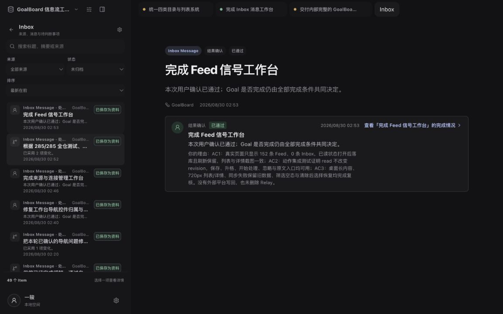
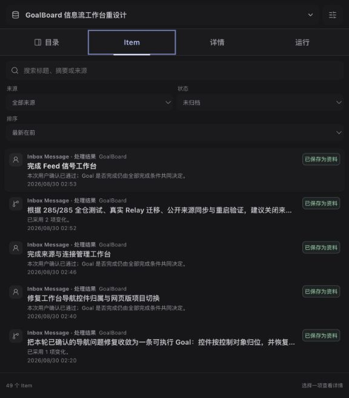

# Inbox 消息工作台验收记录

验收日期：2026-08-30
完成等级：内部完整
验收范围：严格 Inbox Message 目录、详情动作、窄屏工作区与恢复路径。

## AC1

Inbox 与 Feed 已严格隔离，并共用统一的目录列表语法：类型、来源、状态、标题、摘要和时间在固定层级内对齐。

- 桌面实测：Inbox 目录只显示 `inbox_message`，共 49 条；首项、键盘焦点和右侧详情始终同步。
- 查询、来源、状态与排序均会真实改变结果；Inbox 查询 `PR #11` 后只剩 1 条 Inbox Message。
- 切到 Feed 后恢复 Feed 自己的查询与筛选，再切回 Inbox 会恢复 `PR #11`；刷新页面后仍保持该状态。
- Feed 的已读状态不会写入 Inbox Message；Inbox 使用处理状态，不混用 Feed 的 `read_at`。

桌面证据：

## AC2

Item 详情中的保存资料、升格 Goal、开始处理、归档/恢复和打开原文均接入真实应用路径，并保持来源只读。

- 已保存 Item 会显示可恢复的完成状态，升格 Goal 会绑定原 Item 与来源上下文。
- 开始处理沿用 Goal Runtime/Terminal 路径，把标题、摘要、正文、来源和附件资料填入处理上下文。
- 归档后的再次保存或升格会返回符合 Item 类型的可理解错误；Inbox 不会显示 Feed 的“已忽略”措辞。
- 本次验收未向 GitHub、Gmail 或其他来源执行写回，也没有删除 Relay。

自动化证据：`tests/web.test.ts`、`tests/desktop-tui.test.ts`、`tests/feed.test.ts`。

## AC3

空结果、重复动作、异常状态、刷新和重启后的恢复路径均可用。

- 无结果时显示“没有符合当前条件的 Item”，并提供“清除筛选”恢复入口；点击后恢复 49 条 Inbox Message。
- 窄屏下目录与详情通过工作区标签切换，无横向溢出；搜索框保持单行，不再出现多余网格行。
- 键盘 `ArrowUp`、`ArrowDown`、`Home`、`End` 使用 roving focus，同步选择项和详情。
- 浏览器重载后仍恢复当前目录、Inbox preset、查询条件和严格类型隔离。
- 接口与 Store 测试覆盖重复动作、已归档转换、无效 Feed 已读调用和持久化恢复。

窄屏证据：

## 自动化结果

- `pnpm typecheck`：通过。
- `node --import tsx --test tests/feed.test.ts`：6/6 通过。
- `node --import tsx --test tests/web.test.ts tests/desktop-tui.test.ts`：通过。
- `pnpm test`：286/286 通过，包含构建。
- `git diff --check`：通过。
